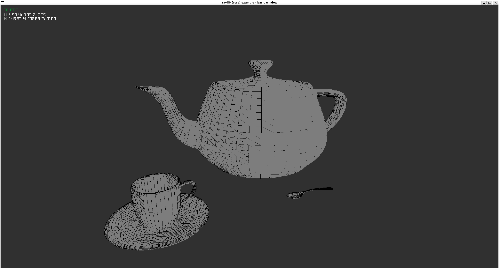

# Software Rasterizer in C

Calculations done by software and passed to an array of [raylib](https://github.com/raysan5/raylib) Colors to be render on a texture the size of the screen with auto resize calculation.

Rasterizer implementation inspired on this book;

https://gabrielgambetta.com/computer-graphics-from-scratch/

-   [x] Draw Lines
-   [x] Draw Filled Triangle
-   [x] Shaded Triangle
-   [x] Perspective Projection
-   [x] Describing and rendering a scene (With camera controls)
-   [x] Clipping
    -   [x] Full frustum culling - Near, far, left, right, top and bottom planes.
    -   [x] Automatically calculate frustum on screen resize.
    -   [x] Dynamic mesh generation on clipping plane.
-   [x] Back face culling
-   [x] Depth buffer
-   [x] Simple OBJ parser
    -   [x] Vertex data
    -   [x] Normal data
        -   [x] Render using normal data
    -   [ ] UV data
-   [ ] Shading
-   [ ] Texture
-   [ ] More...

# Showcase

## Mix of objects loaded from file and generated from code


## Utah teapot/set from OBJ file



## Back face culling and depth pass


## Frustum culling and clipping planes


# Building

On windows it uses `Mingw-w64-x86_64-winpthreads` for building and `GnuWin32` make, on Linux, I can't garantee for now, exactly all dependencies but, `build-essentials` of your platform should work, also, it depends on X11, so maybe, further configuration is need.
With this in mind, just do the following;

-   build process expects a `bin` directory, so, you should create it `mkdir bin`(on powershell all command will work as expected).

```bash
$ make release && ./bin/c_raster
```

To run in debug mode, do the following;

```bash
$ make run
```
